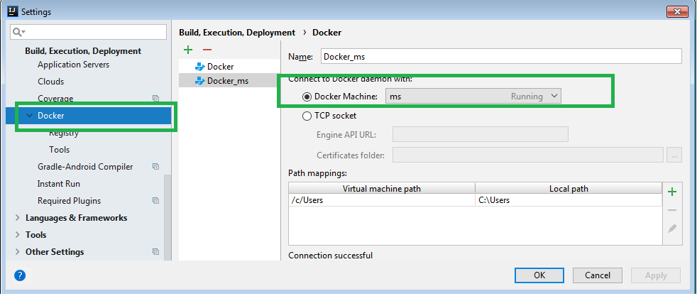
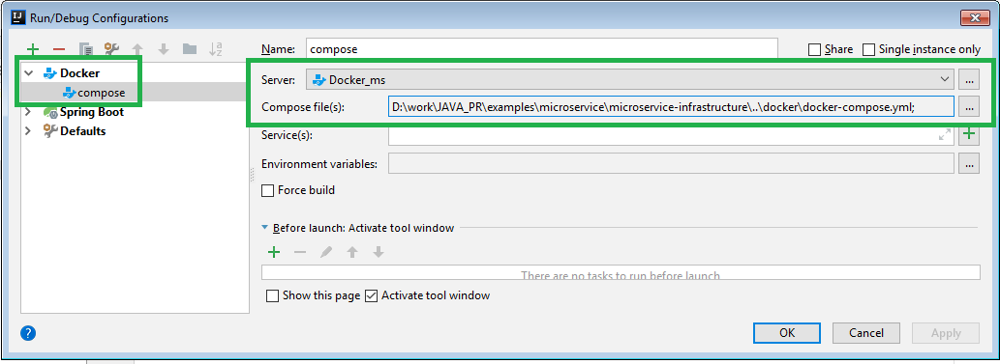
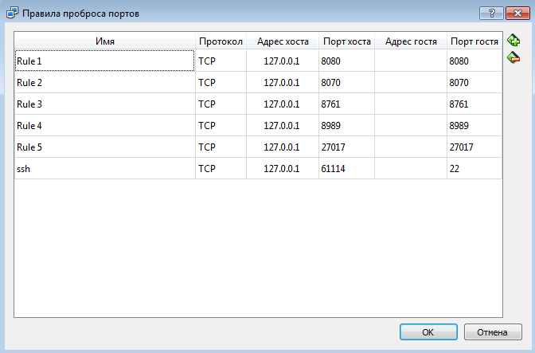

# How to Run

This is a step-by-step guide how to run the example:

## Installation
- Install Maven, see https://maven.apache.org/download.cgi
- Install Virtual Box from https://www.virtualbox.org/wiki/Downloads
- Run script scripts/createdemo.sh to create a Docker Machine based environment for the demo 
- Start Oracle VM VirtualBox and run docker machine instance
- Install Intellij IDEA docker plugin and connect to the Docker Machine with settings below:

- Create a new docker config with settings below:

docker-compose.yml located in `./docker/` folder
- Run `./mvnw clean package`
- Run run docker-compose buil with created intellij config above. This will download some base images, install software into Docker images and will therefore take its time:

```
[~/microservice/docker]docker-compose build 
....
Recreating mongodb...
Recreating ms_user-service_1 ... 
Recreating ms_api-gateway_1 ... 
Recreating ms_config... 
'Compose: ../docker/docker-compose.yml' has been deployed successfully.
```

Afterwards the Docker images should have been created. They have the prefix
`ms`. Check wether all containers are running with `docker ps -a`  also shows the terminated Docker containers. That is useful to see Docker containers that crashed rigth after they started.
```
[~/microservice/docker]docker images
REPOSITORY                                      TAG                 IMAGE ID            CREATED              SIZE
ms_user-service                                 latest              7f7f51fc9fd4        50 seconds ago       228MB
ms_api-gateway                                  latest              8a5cfb2a7b01        54 seconds ago       210MB
ms_config                                       latest              6081c8f9204f        About a minute ago   210MB
```

The example need a lot of RAM. You should configure Docker to use 4
GB of RAM. Otherwise Docker containers might be killed due to lack
of RAM. On Windows and macOS you can find the RAM setting in the
Docker application under Preferences/ Advanced.

You can access:

* The application through Api gateway at http://192.168.99.100:10012
* The Eureka dashboard at http://localhost:8761/
* The Hystrix dashboard at http://localhost:8989/

You can terminate all containers using `docker-compose down`.

## Local debugging

You may debug a microservice locally as a simple java app (if it is allowed by concrete microservice) not using the docker environment completely. 

However since some microservices coupled by it's API you need to deploy them as docker containers to get the whole environment working. In order to do so you should:
- Run docker-compose command
- If you use docker-toolbox expose several ports for infrastructure with settings -> network dialogue
